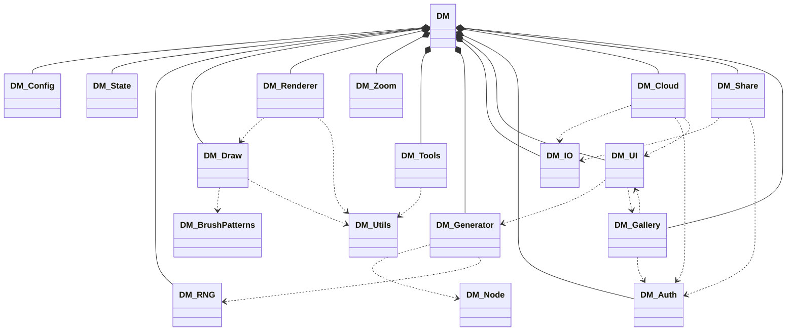

```mermaid
classDiagram
    direction TB

    class DM {
    }

    class DM_Config {
    }

    class DM_State {
    }

    class DM_RNG {
    }

    class DM_Draw {
    }

    class DM_BrushPatterns {
    }

    class DM_Utils {
    }

    class DM_Renderer {
    }

    class DM_Zoom {
    }

    class DM_Tools {
    }

    class DM_Generator {
    }

    class DM_IO {
    }

    class DM_UI {
    }

    class DM_Auth {
    }

    class DM_Cloud {
    }

    class DM_Share {
    }

    class DM_Gallery {
    }

    DM *-- DM_Config
    DM *-- DM_State
    DM *-- DM_RNG
    DM *-- DM_Draw
    DM *-- DM_Renderer
    DM *-- DM_Zoom
    DM *-- DM_Tools
    DM *-- DM_Generator
    DM *-- DM_IO
    DM *-- DM_UI
    DM *-- DM_Auth
    DM *-- DM_Cloud
    DM *-- DM_Share
    DM *-- DM_Gallery

    DM_Draw ..> DM_BrushPatterns
    DM_Draw ..> DM_Utils
    DM_Generator ..> DM_Node
    DM_Generator ..> DM_RNG
    DM_Renderer ..> DM_Draw
    DM_Renderer ..> DM_Utils
    DM_Tools ..> DM_Utils
    DM_UI ..> DM_Generator
    DM_Cloud ..> DM_IO
    DM_Cloud ..> DM_Auth
    DM_Cloud ..> DM_UI
    DM_Share ..> DM_IO
    DM_Share ..> DM_Auth
    DM_UI ..> DM_Gallery
    DM_Gallery ..> DM_Auth
    DM_Gallery ..> DM_UI
```
