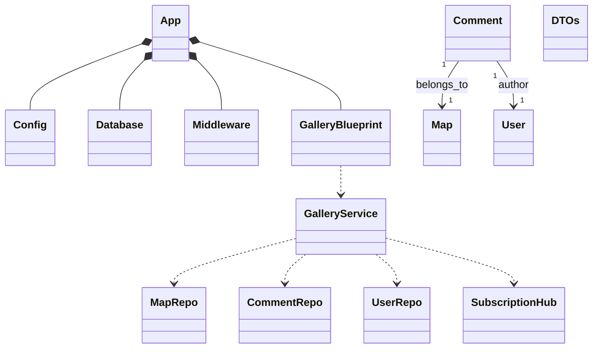

```mermaid
classDiagram
    direction TB

    class App {
    }

    class Config {
    }

    class GalleryBlueprint {
    }

    class User {
    }

    class Map {
    }

    class Comment {
    }

    class DTOs {
    }

    class MapRepo {
    }

    class CommentRepo {
    }

    class UserRepo {
    }

    class GalleryService {
    }

    class SubscriptionHub {
    }

    class Database {
    }

    class Middleware {
    }

    App *-- Config
    App *-- Database
    App *-- Middleware
    App *-- GalleryBlueprint

    GalleryBlueprint ..> GalleryService
    GalleryService ..> MapRepo
    GalleryService ..> CommentRepo
    GalleryService ..> UserRepo
    GalleryService ..> SubscriptionHub

    Comment "1" --> "1" Map : belongs_to
    Comment "1" --> "1" User : author
```
