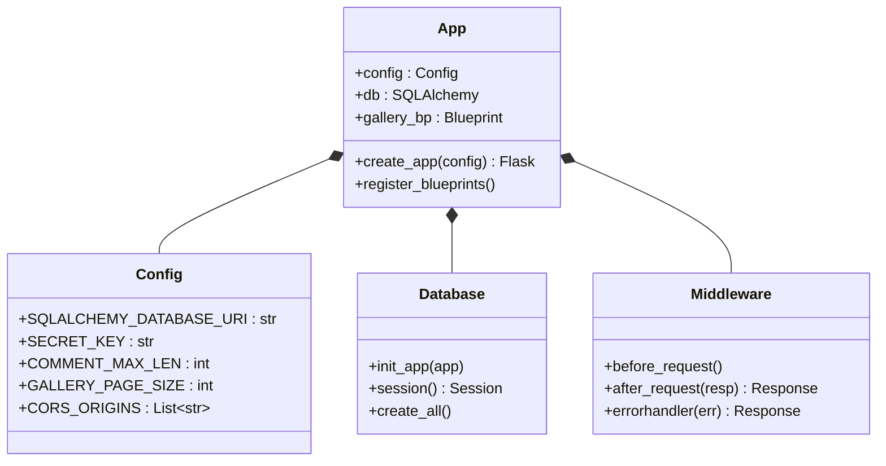

```mermaid
classDiagram
    direction TB

    class App {
        +config : Config
        +db : SQLAlchemy
        +gallery_bp : Blueprint
        +create_app(config) Flask
        +register_blueprints()
    }

    class Config {
        +SQLALCHEMY_DATABASE_URI : str
        +SECRET_KEY : str
        +COMMENT_MAX_LEN : int
        +GALLERY_PAGE_SIZE : int
        +CORS_ORIGINS : List~str~
    }

    class Database {
        +init_app(app)
        +session() Session
        +create_all()
    }

    class Middleware {
        +before_request()
        +after_request(resp) Response
        +errorhandler(err) Response
    }

    App *-- Config
    App *-- Database
    App *-- Middleware
```
