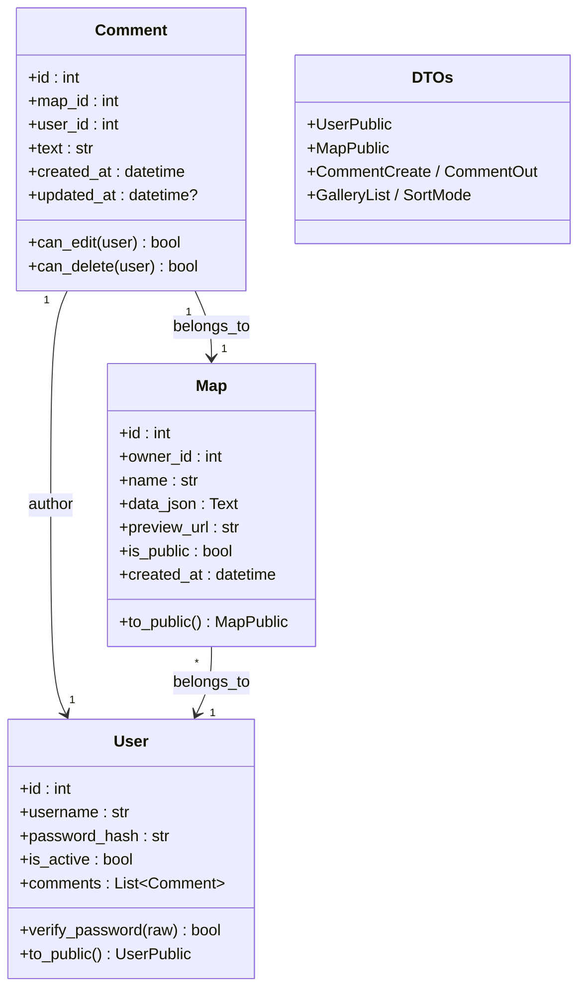

```mermaid
classDiagram
    direction TB

    class User {
        +id : int
        +username : str
        +password_hash : str
        +is_active : bool
        +comments : List~Comment~
        +verify_password(raw) bool
        +to_public() UserPublic
    }

    class Map {
        +id : int
        +owner_id : int
        +name : str
        +data_json : Text
        +preview_url : str
        +is_public : bool
        +created_at : datetime
        +to_public() MapPublic
    }

    class Comment {
        +id : int
        +map_id : int
        +user_id : int
        +text : str
        +created_at : datetime
        +updated_at : datetime?
        +can_edit(user) bool
        +can_delete(user) bool
    }

    class DTOs {
        +UserPublic
        +MapPublic
        +CommentCreate / CommentOut
        +GalleryList / SortMode
    }

    Comment "1" --> "1" Map : belongs_to
    Comment "1" --> "1" User : author
    Map "*" --> "1" User : belongs_to
```
