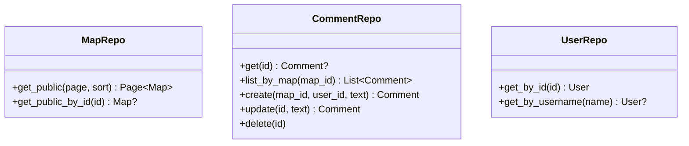

```mermaid
classDiagram
    direction TB

    class MapRepo {
        +get_public(page, sort) Page~Map~
        +get_public_by_id(id) Map?
    }

    class CommentRepo {
        +get(id) Comment?
        +list_by_map(map_id) List~Comment~
        +create(map_id, user_id, text) Comment
        +update(id, text) Comment
        +delete(id)
    }

    class UserRepo {
        +get_by_id(id) User
        +get_by_username(name) User?
    }
```
