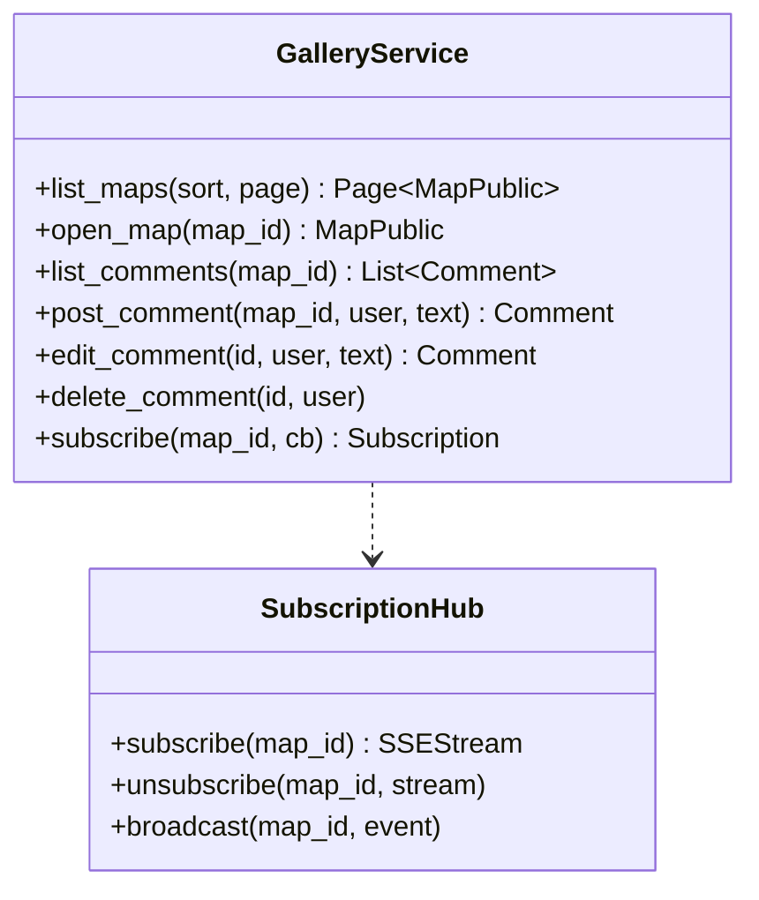

```mermaid
classDiagram
    direction TB

    class GalleryService {
        +list_maps(sort, page) Page~MapPublic~
        +open_map(map_id) MapPublic
        +list_comments(map_id) List~Comment~
        +post_comment(map_id, user, text) Comment
        +edit_comment(id, user, text) Comment
        +delete_comment(id, user)
        +subscribe(map_id, cb) Subscription
    }

    class SubscriptionHub {
        +subscribe(map_id) SSEStream
        +unsubscribe(map_id, stream)
        +broadcast(map_id, event)
    }

    GalleryService ..> SubscriptionHub
```
