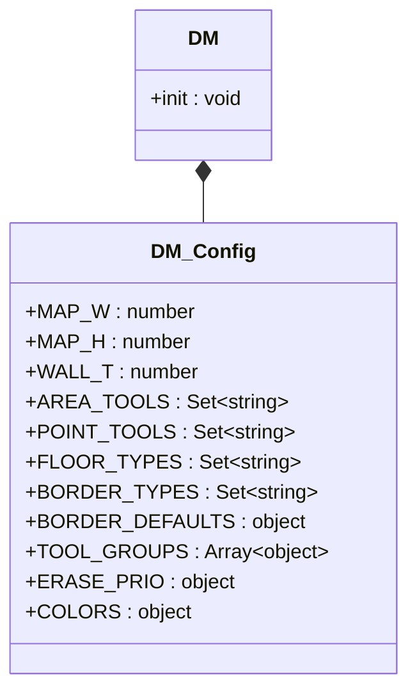

```mermaid
classDiagram
    direction TB

    class DM {
        +init : void
    }

    class DM_Config {
        +MAP_W : number
        +MAP_H : number
        +WALL_T : number
        +AREA_TOOLS : Set~string~
        +POINT_TOOLS : Set~string~
        +FLOOR_TYPES : Set~string~
        +BORDER_TYPES : Set~string~
        +BORDER_DEFAULTS : object
        +TOOL_GROUPS : Array~object~
        +ERASE_PRIO : object
        +COLORS : object
    }

    DM *-- DM_Config
```
