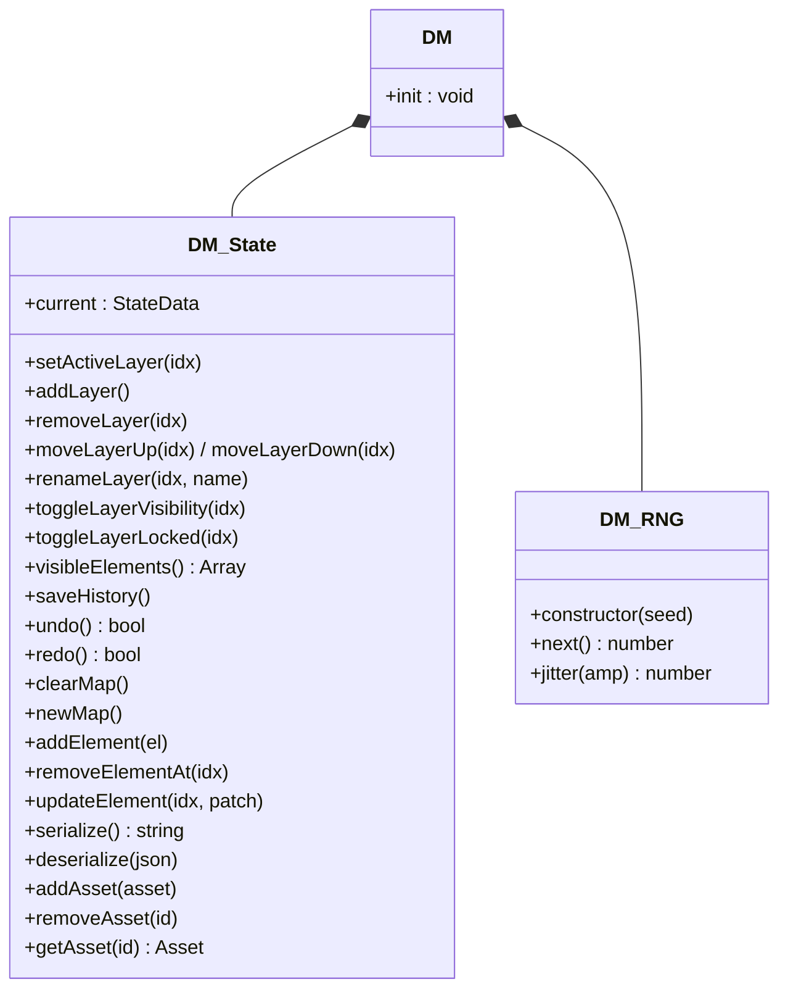

```mermaid
classDiagram
    direction TB

    class DM {
        +init : void
    }

    class DM_State {
        +current : StateData
        +setActiveLayer(idx)
        +addLayer()
        +removeLayer(idx)
        +moveLayerUp(idx) / moveLayerDown(idx)
        +renameLayer(idx, name)
        +toggleLayerVisibility(idx)
        +toggleLayerLocked(idx)
        +visibleElements() Array
        +saveHistory()
        +undo() bool
        +redo() bool
        +clearMap()
        +newMap()
        +addElement(el)
        +removeElementAt(idx)
        +updateElement(idx, patch)
        +serialize() string
        +deserialize(json)
        +addAsset(asset)
        +removeAsset(id)
        +getAsset(id) Asset
    }

    class DM_RNG {
        +constructor(seed)
        +next() number
        +jitter(amp) number
    }

    DM *-- DM_State
    DM *-- DM_RNG
```
