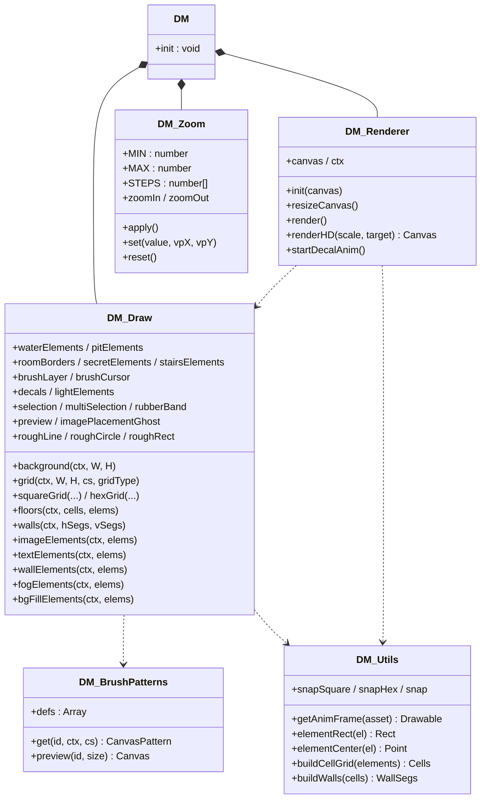

```mermaid
classDiagram
    direction TB

    class DM {
        +init : void
    }

    class DM_Draw {
        +background(ctx, W, H)
        +grid(ctx, W, H, cs, gridType)
        +squareGrid(...) / hexGrid(...)
        +floors(ctx, cells, elems)
        +walls(ctx, hSegs, vSegs)
        +waterElements / pitElements
        +roomBorders / secretElements / stairsElements
        +imageElements(ctx, elems)
        +textElements(ctx, elems)
        +wallElements(ctx, elems)
        +brushLayer / brushCursor
        +fogElements(ctx, elems)
        +decals / lightElements
        +selection / multiSelection / rubberBand
        +preview / imagePlacementGhost
        +roughLine / roughCircle / roughRect
        +bgFillElements(ctx, elems)
    }

    class DM_BrushPatterns {
        +defs : Array
        +get(id, ctx, cs) CanvasPattern
        +preview(id, size) Canvas
    }

    class DM_Utils {
        +getAnimFrame(asset) Drawable
        +elementRect(el) Rect
        +elementCenter(el) Point
        +snapSquare / snapHex / snap
        +buildCellGrid(elements) Cells
        +buildWalls(cells) WallSegs
    }

    class DM_Renderer {
        +canvas / ctx
        +init(canvas)
        +resizeCanvas()
        +render()
        +renderHD(scale, target) Canvas
        +startDecalAnim()
    }

    class DM_Zoom {
        +MIN : number
        +MAX : number
        +STEPS : number[]
        +apply()
        +set(value, vpX, vpY)
        +zoomIn / zoomOut
        +reset()
    }

    DM *-- DM_Draw
    DM *-- DM_Renderer
    DM *-- DM_Zoom
    DM_Draw ..> DM_BrushPatterns
    DM_Draw ..> DM_Utils
    DM_Renderer ..> DM_Draw
    DM_Renderer ..> DM_Utils
```
