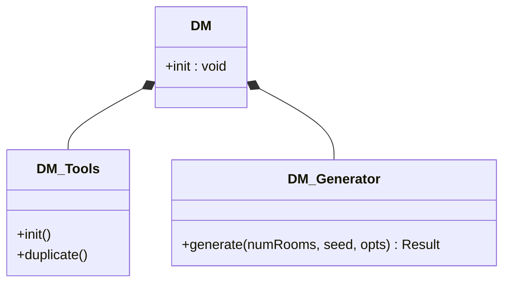

```mermaid
classDiagram
    direction TB

    class DM {
        +init : void
    }

    class DM_Tools {
        +init()
        +duplicate()
    }

    class DM_Generator {
        +generate(numRooms, seed, opts) Result
    }

    DM *-- DM_Tools
    DM *-- DM_Generator
```

