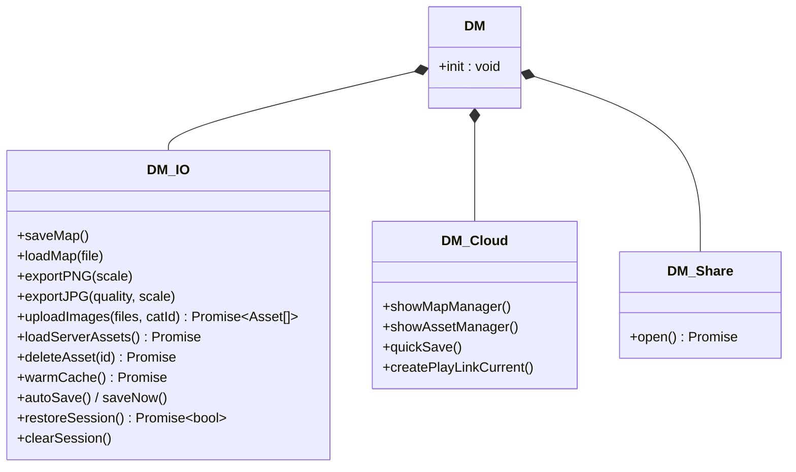

```mermaid
classDiagram
    direction TB

    class DM {
        +init : void
    }

    class DM_IO {
        +saveMap()
        +loadMap(file)
        +exportPNG(scale)
        +exportJPG(quality, scale)
        +uploadImages(files, catId) Promise~Asset[]~
        +loadServerAssets() Promise
        +deleteAsset(id) Promise
        +warmCache() Promise
        +autoSave() / saveNow()
        +restoreSession() Promise~bool~
        +clearSession()
    }

    class DM_Cloud {
        +showMapManager()
        +showAssetManager()
        +quickSave()
        +createPlayLinkCurrent()
    }

    class DM_Share {
        +open() Promise
    }

    DM *-- DM_IO
    DM *-- DM_Cloud
    DM *-- DM_Share
```
