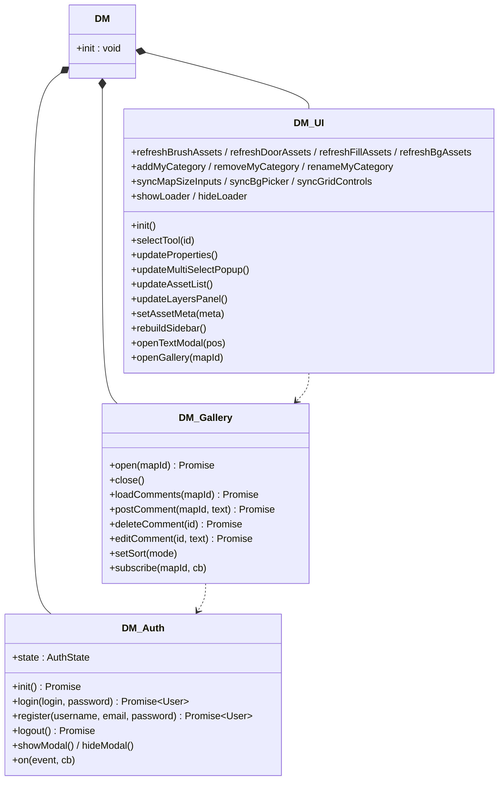

```mermaid
classDiagram
    direction TB

    class DM {
        +init : void
    }

    class DM_UI {
        +init()
        +selectTool(id)
        +updateProperties()
        +updateMultiSelectPopup()
        +updateAssetList()
        +updateLayersPanel()
        +refreshBrushAssets / refreshDoorAssets / refreshFillAssets / refreshBgAssets
        +setAssetMeta(meta)
        +addMyCategory / removeMyCategory / renameMyCategory
        +syncMapSizeInputs / syncBgPicker / syncGridControls
        +rebuildSidebar()
        +openTextModal(pos)
        +showLoader / hideLoader
        +openGallery(mapId)
    }

    class DM_Auth {
        +state : AuthState
        +init() Promise
        +login(login, password) Promise~User~
        +register(username, email, password) Promise~User~
        +logout() Promise
        +showModal() / hideModal()
        +on(event, cb)
    }

    class DM_Gallery {
        +open(mapId) Promise
        +close()
        +loadComments(mapId) Promise
        +postComment(mapId, text) Promise
        +deleteComment(id) Promise
        +editComment(id, text) Promise
        +setSort(mode)
        +subscribe(mapId, cb)
    }

    DM *-- DM_UI
    DM *-- DM_Auth
    DM *-- DM_Gallery
    DM_UI ..> DM_Gallery
    DM_Gallery ..> DM_Auth
```
